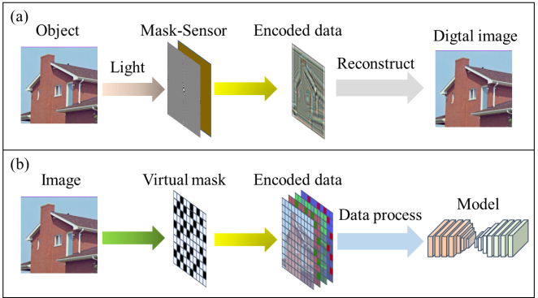
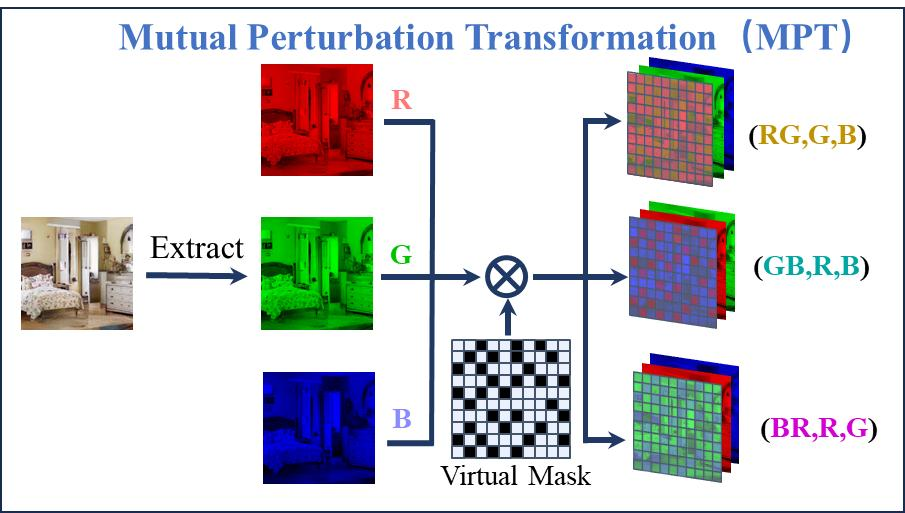
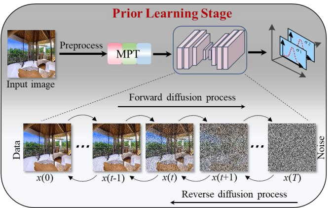
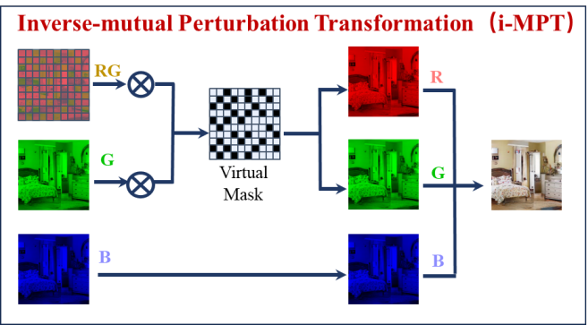
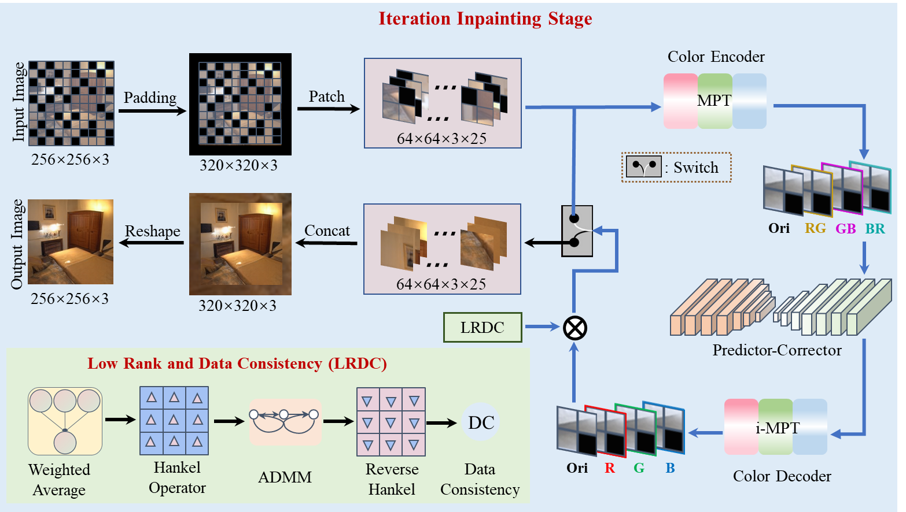
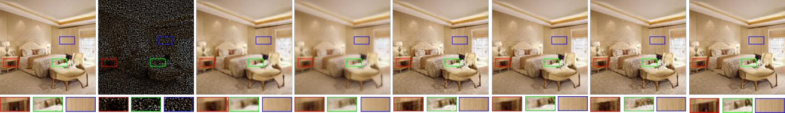
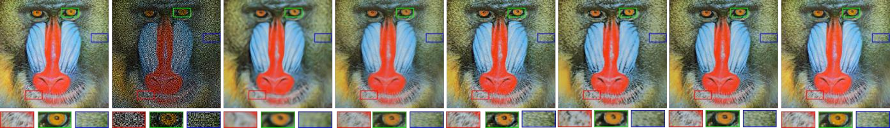
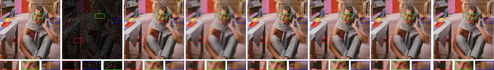

# ESDiff: Encoding Strategy-inspired Diffusion Model with Few-shot Learning for Color Image Inpainting
[](https://arxiv.org/abs/2504.17524)
[](https://opensource.org/licenses/MIT)
This repository contains the PyTorch implementation of the paper **"ESDiff: Encoding Strategy-inspired Diffusion Model with Few-shot Learning for Color Image Inpainting"**.
> **Code Availability:** The source code is available at [https://github.com/yqx7150/ESDiff](https://github.com/yqx7150/ESDiff)

## Abstract
Image inpainting is a technique used to restore missing or damaged regions of an image. Traditional methods primarily utilize information from adjacent pixels for reconstructing missing areas, while they struggle to preserve complex details and structures. Simultaneously, models based on deep learning necessitate substantial amounts of training data. To address this challenge, an encoding strategy-inspired diffusion model with few-shot learning for color image inpainting is proposed in this paper. The main idea of this novel encoding strategy is the deployment of a "virtual mask" to construct high-dimensional objects through mutual perturbations between channels. This approach enables the diffusion model to capture diverse image representations and detailed features from limited training samples. Moreover, the encoding strategy leverages redundancy between channels, integrates with low-rank methods during iterative inpainting, and incorporates the diffusion model to achieve accurate information output. Experimental results indicate that our method exceeds current techniques in quantitative metrics, and the reconstructed images quality has been improved in aspects oftexture and structural integrity, leading to more precise and coherent results.


## Method Overview
Index Terms—Color image inpainting, encoding strategy, few-shot learning, diffusion model.'
<p align="center">
  
  <br>
  <em>Figure 1: The pipeline of coded mask imaging in (a) and our encoding strategy introduced by a “virtual mask” in (b).</em>
</p>

<p align="center">
  
  <br>
  <em>Figure 2: The specific process of mutual perturbation transformation. We perturb a virtual mask generated by a normal distribution and use the redundancy between the channels of the image to bring more changes and diversity to the color coding of the image, generating a more complex image representation and training Produce higher-dimensional, higher parameterized models.</em>
</p>

<p align="center">
  
  <br>
  <em>Figure 3: The pipeline of the prior learning stage in ESDiff. Before the prior learning of the score-based network, internal-middle patches are extracted from the original images and then perform various perturbations on the original patches.</em>
</p>

<p align="center">
  
  <br>
  <em>Figure 4: Reverse restoration process for the RG perturbation case. Through the saved virtual mask and the R channel image and G channel image disturbed by the G channel, we can restore the original image information.</em>
</p>


<p align="center">
  
  <br>
  <em>Figure 5: The pipeline of iteration inpainting procedure in ESDiff. Three steps are contained in the procedure: Firstly, patches are extracted patch-by-patch from the observation after padding. Then, perform R-G perturbation, G-B perturbation, and B-R perturbation to obtain three different types of perturbation patches with a size of 64*64*3. Finally, the PC sampler, Inverse Perturbation, Low-rank step and DC steps are performed alternatively.</em>
</p>

## Results
<p align="center">
  
  <br>
  <em>Figure 6: Subjective comparison on LSUN-bedroom dataset. The results are restored from the observation under the 80% missing samples. (a) Ground truth (b) Observation (c) kernel regression (d) K-SVD (e) ALOHA (f) DIP (g) NCSN++ (h) ESDiff.</em>
</p>

<p align="center">
  
  <br>
  <em>Figure 7: Subjective comparison on LSUN-bedroom dataset. The results are restored from the observation, which covers block with 80%. (a) Ground truth (b) Observation (c) kernel regression (d) K-SVD (e) ALOHA (f) DIP (g) NCSN++ (h) ESDiff.</em>
</p>

<p align="center">
  
  <br>
  <em>Figure 8: Subjective comparison for restoring image Baboon. The results are restored from the observation under the 50% missing samples. (a) Ground truth (b) Observation (c) kernel regression (d) K-SVD (e) ALOHA (f) DIP (g) NCSN++ (h) ESDiff.</em>
</p>

<p align="center">
  
  <br>
  <em>Figure 9: Subjective comparison for recovering image Barbara. The results are restored from the observation under 80% missing samples. (a) Ground truth (b) Observation (c) kernel regression (d) K-SVD (e) ALOHA (f) DIP (g) NCSN++ (h) ESDiff.</em>
</p>


## Citation
```bibtex
If you find this work useful for your research, please cite our paper:
@article{zhang2025esdiff,
  title={ESDiff: Encoding Strategy-inspired Diffusion Model with Few-shot Learning for Color Image Inpainting},
  author={Zhang, Junyan and Li, Yan and Geng, Mengxiao and Shi, Liu and Liu, Qiegen},
  journal={arXiv preprint arXiv:2504.17524},
  year={2025}
}


